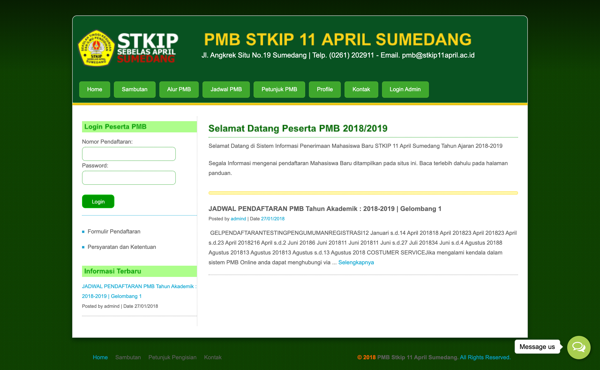

#### Berikut beberapa fiturnya: 🔥

1. Pengelolaan Informasi (sambutan, alur, petunjuk, profil)
2. Pengelolaan Jadwal PMB
3. Data Berita
4. Persyaratan
5. Soal Test dan Bank Soal serta kategorinya
6. Pengaturan Periode
7. Data Persyaratan
8. Daftar Peserta
9. Cek Persyaratan
10. Verifikasi Pembayaran
11. Nilai Test
12. Seleksi
13. Pendaftaran
14. Login Calon Mahasiswa
15. Test online
16. Hasil seleksi dll

#### Cara melakukan kontribusi 👨🏻‍💻

1. Baca dan pahami aturan berkontribusi [contributing](CONTRIBUTING.md) ✅
2. Fork repository terlebih dahulu
3. Clone repository yang telah di fork
4. Lakukan perubahan
5. Gunakan branch
6. Lakukan pull request
7. Pertama kali melakukan kontribusi ? [Penduan Berkontribusi](https://akrabat.com/the-beginners-guide-to-contributing-to-a-github-project/) ✅
   
---

<a href="#"><a>

